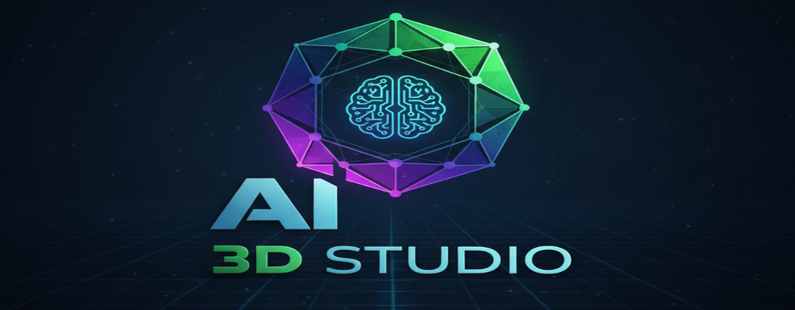

# AI 3D Studio

<div align="center">



**AI 驱动的在线 CAD 建模工具**

基于 OpenCascade.js 和 DeepSeek，让 3D 建模变得简单

[](https://opensource.org/licenses/MIT)
[](https://nodejs.org/)
[](http://makeapullrequest.com)

[快速开始](#-快速开始) • [功能特性](#-功能特性) • [文档](#-文档) • [示例](#-示例) • [贡献](#-贡献)

</div>

---

## 🌟 项目亮点

- 🤖 **AI 代码生成** - 用自然语言描述，AI 自动生成 3D 模型代码
- 🎨 **工程软件配色** - 专业的深色主题，类似 AutoCAD/SolidWorks
- 📱 **完美响应式** - 桌面、平板、手机全平台支持
- 👤 **用户系统** - 完整的注册、登录、积分管理
- 🔄 **Tab 切换布局** - 代码编辑器与 3D 视图智能切换
- 💎 **强大的 CAD 内核** - 基于 OpenCascade.js，支持复杂建模

## 🚀 快速开始

### 前置要求

- Node.js 12+ 
- 现代浏览器（Chrome、Firefox、Edge、Safari）
- [Supabase](https://supabase.com/) 账户（免费）
- [DeepSeek](https://platform.deepseek.com/) API 密钥

### 安装步骤

```bash
# 1. 克隆项目
git clone https://github.com/yourusername/AI3D.git
cd AI3D

# 2. 安装依赖
npm install

# 3. 配置服务
cp js/config.example.js js/config.js
# 编辑 js/config.js 填入你的 API 密钥

# 4. 启动应用
npm start
# 或使用脚本: start.bat (Windows) / ./start.sh (Linux/Mac)
```

### 5 分钟快速配置

详细配置步骤请查看 [SETUP.md](SETUP.md)

1. **创建 Supabase 项目** → 获取 URL 和 Key
2. **执行数据库脚本** → 创建用户表和积分表
3. **获取 DeepSeek API Key** → 注册并创建密钥
4. **填写配置文件** → 编辑 `js/config.js`
5. **启动应用** → 运行 `npm start`

## ✨ 功能特性

### 🤖 AI 智能生成

```
输入: "创建一个边长50的立方体，中间挖一个半径20的球形孔"
输出: 完整的可执行代码 + 3D 模型
```

- 自然语言理解
- 智能代码生成
- 自动评估渲染
- 支持复杂描述

### 👤 用户系统

- ✅ 邮箱注册/登录
- ✅ 新用户赠送 100 积分
- ✅ 按 token 消耗积分
- ✅ 完整的消费记录
- ✅ 用户中心管理

### 🎨 现代化 UI

- ✅ 工程软件专业配色
- ✅ 流畅的动画效果
- ✅ Tab 页面切换
- ✅ 响应式设计
- ✅ 触摸优化

### 🔧 强大的 CAD 功能

#### 基础形状
```javascript
Box(100, 50, 30)           // 长方体
Sphere(50)                 // 球体
Cylinder(30, 100)          // 圆柱体
Cone(40, 20, 80)          // 圆锥体
```

#### 布尔运算
```javascript
Union([shape1, shape2])           // 并集
Difference(shape1, shape2)        // 差集
Intersection([shape1, shape2])    // 交集
```

#### 高级操作
```javascript
Extrude(profile, 100)             // 拉伸
Revolve(profile, 360)             // 旋转
Loft([profile1, profile2])        // 放样
FilletEdges(shape, 5)             // 圆角
```

#### 参数化设计
```javascript
let radius = Slider("半径", 30, 10, 50);
let height = Slider("高度", 100, 50, 200);
Cylinder(radius, height);
```

## 📚 文档

| 文档 | 说明 |
|------|------|
| [README_CN.md](README_CN.md) | 完整的中文文档 |
| [QUICKSTART.md](QUICKSTART.md) | 5 分钟快速入门 |
| [SETUP.md](SETUP.md) | 详细配置说明 |
| [AI_PROMPTS.md](AI_PROMPTS.md) | AI 提示词示例 |
| [CHANGELOG.md](CHANGELOG.md) | 更新日志 |
| [PROJECT_STRUCTURE.md](PROJECT_STRUCTURE.md) | 项目结构 |

## 🎯 示例

### 示例 1: 简单几何体

**AI 输入:**
```
创建一个半径为 50 的球体
```

**生成代码:**
```javascript
let sphere = Sphere(50);
sphere;
```

### 示例 2: 组合形状

**AI 输入:**
```
创建一个边长 100 的立方体，中间挖一个半径 30 的球形孔
```

**生成代码:**
```javascript
let box = Box(100, 100, 100, true);
let sphere = Sphere(30);
let result = Difference(box, sphere);
result;
```

### 示例 3: 参数化模型

**AI 输入:**
```
创建一个可调节的圆柱体，半径范围 10-50，高度范围 20-100
```

**生成代码:**
```javascript
let radius = Slider("半径", 30, 10, 50);
let height = Slider("高度", 60, 20, 100);
let cylinder = Cylinder(radius, height, true);
cylinder;
```

更多示例请查看 [AI_PROMPTS.md](AI_PROMPTS.md)

## 🖼️ 截图

### 桌面端


### 移动端
响应式设计，完美适配手机和平板

## 🛠️ 技术栈

### 前端
- **3D 引擎**: Three.js
- **CAD 内核**: OpenCascade.js
- **代码编辑器**: Monaco Editor
- **布局系统**: Golden Layout
- **UI 控件**: Tweakpane

### 后端服务
- **认证**: Supabase Auth
- **数据库**: Supabase PostgreSQL
- **AI**: DeepSeek API

### 开发工具
- **包管理**: npm
- **服务器**: http-server

## 📊 功能对比

| 功能 | AI 3D Studio | AI 3D Studio |
|------|---------------|------------------|
| 代码编辑 | ✅ | ✅ |
| 3D 渲染 | ✅ | ✅ |
| AI 生成 | ❌ | ✅ ⭐ |
| 用户系统 | ❌ | ✅ ⭐ |
| 积分系统 | ❌ | ✅ ⭐ |
| Tab 布局 | ❌ | ✅ ⭐ |
| 响应式 | 部分 | 完全 ⭐ |
| 工程配色 | ❌ | ✅ ⭐ |

## 💰 积分系统

- 新用户注册赠送 **100 积分**
- AI 生成按 token 消耗
- 默认费率：**0.01 积分/token**

**消耗示例:**
- 简单模型（~500 tokens）≈ 5 积分
- 中等复杂（~1000 tokens）≈ 10 积分
- 复杂模型（~2000 tokens）≈ 20 积分

## 🔒 安全性

- ✅ Supabase 行级安全策略（RLS）
- ✅ API 密钥环境变量保护
- ✅ 配置文件 .gitignore
- ✅ 用户密码加密存储
- ✅ 会话令牌管理

## 🤝 贡献

欢迎贡献代码、报告问题或提出建议！

### 贡献方式

1. Fork 本项目
2. 创建特性分支 (`git checkout -b feature/AmazingFeature`)
3. 提交更改 (`git commit -m 'Add some AmazingFeature'`)
4. 推送到分支 (`git push origin feature/AmazingFeature`)
5. 开启 Pull Request

### 开发指南

查看 [PROJECT_STRUCTURE.md](PROJECT_STRUCTURE.md) 了解项目结构

## 🐛 问题反馈

遇到问题？请通过以下方式反馈：

1. [GitHub Issues](https://github.com/yourusername/AI3D/issues)
2. 查看 [常见问题](SETUP.md#常见问题)
3. 阅读 [文档](README_CN.md)

## 📝 更新日志

查看 [CHANGELOG.md](CHANGELOG.md) 了解版本历史

### 最新版本: v1.0.0 (2026-01-17)

- ✨ AI 代码生成功能
- ✨ 用户认证和积分系统
- ✨ Tab 页面布局
- ✨ 工程软件配色
- ✨ 完全响应式设计
- ✨ 优化的菜单系统

## 🔮 未来计划

### v1.1.0
- [ ] 积分充值功能
- [ ] 更多 AI 模型选择
- [ ] 代码模板库
- [ ] 项目分享功能

### v1.2.0
- [ ] 协作编辑
- [ ] 云端项目存储
- [ ] 版本历史
- [ ] 评论系统

### v2.0.0
- [ ] 插件系统
- [ ] 自定义主题
- [ ] 高级渲染选项
- [ ] VR/AR 支持

## 🙏 致谢

- [AI 3D Studio](https://github.com/zalo/AI3DStudio) - 提供优秀的基础框架
- [OpenCascade.js](https://github.com/donalffons/opencascade.js) - 强大的 CAD 内核
- [Supabase](https://supabase.com/) - 便捷的后端服务
- [DeepSeek](https://www.deepseek.com/) - 高质量的 AI 服务

## 📄 许可证

本项目采用 MIT 许可证 - 详见 [LICENSE](LICENSE) 文件

基于 [AI 3D Studio](https://github.com/zalo/AI3DStudio) 开发

## 🌐 链接

- **项目主页**: [GitHub](https://github.com/yourusername/AI3D)
- **在线演示**: [Demo](https://yourusername.github.io/AI3D)
- **文档**: [Docs](README_CN.md)
- **问题反馈**: [Issues](https://github.com/yourusername/AI3D/issues)

## 📧 联系方式

- GitHub: [@yourusername](https://github.com/yourusername)
- Email: your.email@example.com

---

<div align="center">

**用 AI 创造你的 3D 世界！** 🚀

Made with ❤️ by AI 3D Studio

[⬆ 回到顶部](#ai-3d-cad-studio)

</div>
